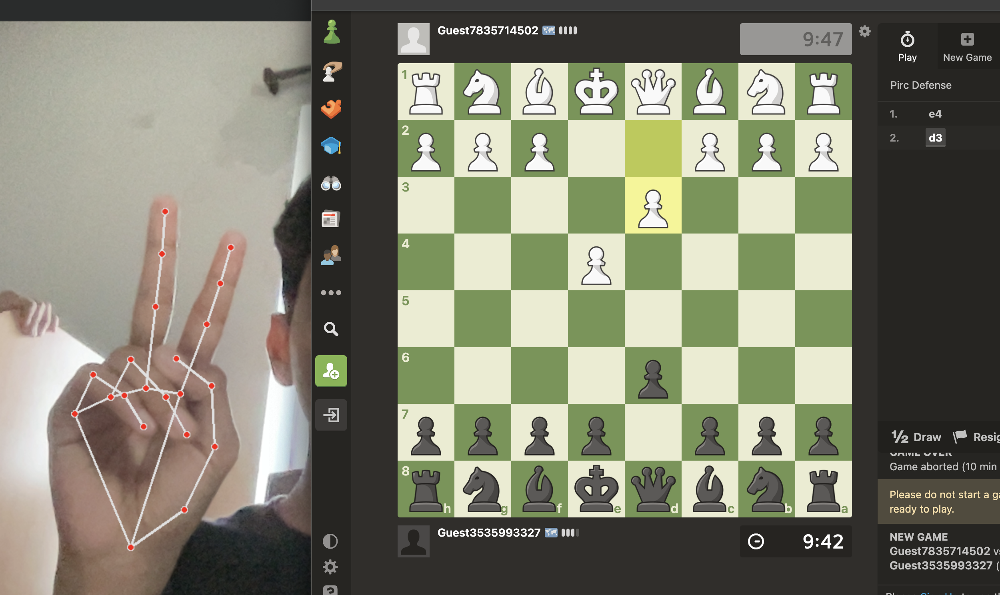

<div align="center">
  <h1><code>PawnPal</code></h1>
  <p><strong>Your AI-powered chess assistant for real-time hand movement tracking and automation on Chess.com.</strong></p>
</div>

## 📖 Table of Contents

- [Introduction](#%E2%84%B9%EF%B8%8F-introduction)
- [Features](#features)
- [Installation](#installation)
- [Usage](#usage)
- [Contribution](#contribution)
- [License](#license)

## ℹ️ Introduction

**PawnPal** combines computer vision and automation to track real-world hand movements on a chessboard and replicate them digitally on Chess.com. Built using Python, OpenCV, MediaPipe, and Selenium, it bridges physical gameplay with the online chess world.

<div align="center">
  <table>
    <tr>
      <td></td>
    </tr>
  </table>
</div>

## 🚀 Features

- **Real-Time Tracking:** Detects hand movements and maps them to corresponding chessboard squares.
- **Online Integration:** Automates moves directly on Chess.com.
- **Gesture Recognition:** Supports gesture-based move confirmation for intuitive gameplay.
- **Dynamic Square Highlighting:** Visual feedback for selected and highlighted squares on the digital board.
- **Customizable Settings:** Easily adjust chessboard dimensions and camera configurations.

## ⚙️ Installation

### Prerequisites

Ensure you have the following installed:

- Python 3.7+
- Google Chrome and [Chromedriver](https://chromedriver.chromium.org/downloads) (Ensure compatibility with your Chrome version)

### Clone and Install Dependencies

```bash
# Clone the repository
$ git clone https://github.com/yourusername/PawnPal.git
$ cd PawnPal

# Install required Python packages
$ pip install -r requirements.txt
```

## 🕹️ Usage

1. **Update Chromedriver Path:** Edit the `chromedriver` path in the script to point to your local Chromedriver.
2. **Run the Script:**

```bash
$ python pawnpal.py
```

3. **Place Your Hand on the Board:** Use your hand to select and move pieces. Two-finger gestures confirm moves.
4. **Exit:** Press `q` to quit the application.

## 🛠️ How It Works

- **Hand Tracking:** Powered by MediaPipe, the script identifies hand landmarks to map movements.
- **Mapping to Chessboard:** Physical movements are translated into chessboard coordinates.
- **Web Automation:** Selenium interacts with Chess.com to highlight and make moves.

## 🤝 Contribution

We welcome contributions to enhance PawnPal! Here are some ways you can help:

- Suggest new features or improvements
- Report bugs
- Submit pull requests
- Enhance documentation

## 📜 License

PawnPal is licensed under the [MIT License](LICENSE). Feel free to use, modify, and distribute this software as per the license.

---

<div align="center">
✨ Happy Chess Playing with <b>PawnPal</b>! ✨
</div>
